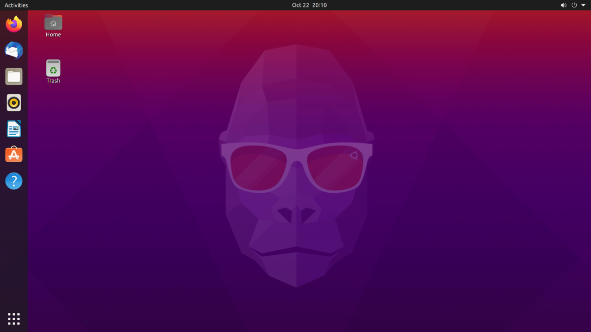

+++
title = "Best Linux Distros for Beginners in 2021"
date = 2021-01-14T17:29:00.004+08:00
updated = 2021-01-15T17:29:00.004+08:00

[taxonomies]
tags = ["Software"]

[extra]
social_media_card = "card.png"
adsense = true
+++

Choosing a Linux distro is not an easy task. New users might be overwhelmed with the hundreds of distros to choose from compared to Windows with just a few versions to choose from. I cannot really tell you which is the best for you as we come with different needs and motives, but here is a list of Linux distros that will help you determine what could be the best for you.
<!-- more -->

Note that this list may vary from user to user. The main criteria I use are ease of use, user experience, and software and hardware support.

## 5. Linux Mint

*Pros*

* Very lightweight and snappy
* Great experience for former Windows users
* Great for older laptops

*Cons*

* The desktop looks dated

[Linux Mint](https://linuxmint.com/) is an Ubuntu-based distro. It comes with the Cinnamon DE environment by default which is noticeably lighter compared to GNOME. But if you do not like Cinnamon, you can choose between XFCE and MATE which are both similarly fast and light desktop environments.

It comes with the traditional desktop experience, so it would work great for users who came from Windows. It is very customizable and there are a lot of themes to choose from.

## 4. Elementary OS

*Pros*

* Very simple to use
* It looks beautiful and minimal
* Supportive app store to indie developers

*Cons*

* You cannot choose other DE besides Pantheon

[Elementary OS](https://elementary.io/) is yet another Ubuntu-based distro, but the difference is that it comes with its own desktop environment, Pantheon, and a minimal set of applications. It is arguably macOS-inspired due to its design language, dock, and the system panel on the top.

To be honest, it is one of the most beautiful Linux distros and its minimalistic look adds to the beauty. The thing I like the most about Elementary OS is its app store which makes it seamless to help hard-working developers.

## 3. Pop!_OS

*Pros*

* Great Nvidia support
* Backed by a hardware-selling company
* Disk encryption on by default

*Cons*

* Desktop environment choice is limited to GNOME
* Not very good with older hardware with less than 1 GB of RAM

[Pop!_OS](https://pop.system76.com/) is an Ubuntu-based Linux distro backed by System76. No wonder why they have better Nvidia driver support as the company backing them sells laptops powered by Nvidia.

It provides a snappy and polished experience with the help of a slightly-modified GNOME desktop environment. It also comes with an auto-tiling extension which could be handy for power users.

## 2. Ubuntu

*Pros*

* Great out-of-the-box experience
* Backed by a company
* Many desktop environments to choose from
* Great community support

*Cons*

* GNOME DE could be heavy with older hardware

[Ubuntu](https://ubuntu.com/) is a Debian-based Linux distro that is backed by Canonical. It comes with GNOME as the default desktop environment, but it comes with others to choose from like Kubuntu (KDE), Lubuntu (LXQt), Ubuntu Mate, UbuntuDDE (Deepin), and many more.

It is simple and easy to operate once you get used to it. Community support is also one of its selling points due to its popularity. It also offers many useful preinstalled applications that could give you a head start.

## Honorable Mentions

### OpenSUSE

It is a distro that is sponsored by a German company, SUSE. You can choose a rolling or stable release. It might not focus on simplicity, but it offers the user great flexibility.

### Deepin

It is a Debian-based distro that comes with its own desktop environment and set of applications. Not only that, but it is subjectively one of the best-looking distros aside from Elementary.

### Manjaro

This is an Arch-based distro. It is like Arch, but it is already configured out-of-the-box without having to manually install the operating system.

### KDE Neon

This is a Linux distro based on Ubuntu LTS versions. It comes with the latest and greatest KDE packages. KDE Plasma, I would say, is the most customizable desktop environment. It has great support with theme engines like Kvantum.

### Debian

It is one of the oldest and most stable Linux distros out there. However, for developers, the packages in the repository may be out-of-date.

 

## 1. Fedora

*Pros*

* Great open-source approach
* Vanilla GNOME experience
* Backed by Red Hat
* Very polished experience

*Cons*

* Software options might be limited

[Fedora](https://fedoraproject.org/) is subjectively the best Linux distro of all time. Like Ubuntu, you are not limited to the GNOME desktop environment due to the variety of officially supported spins. It also comes with strictly FOSS-only preinstalled apps, which might limit your software choice if you do not add additional repositories.

It is great for laptops because they are packed with additional optimizations for better battery life. Furthermore, it is also easier to update the system as its application and system updates are handled within the same application, unlike Ubuntu.

## Conclusion

There is really no best Linux distro. All distros have their purposes that will serve a specific person. No one can tell you what is the best Linux distro. This is just a guide to help you consider a distro that will work best for you. Why not fire up that VM and you can decide for yourself?

 

If you have opinions on the list, feel free to comment below. Have a good day!

