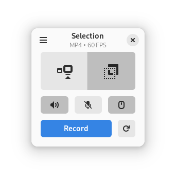
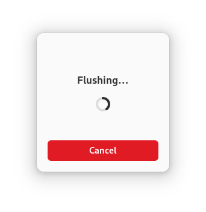
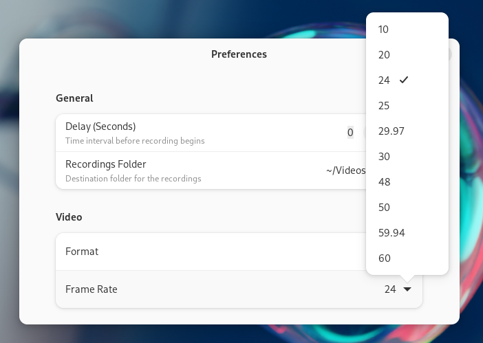
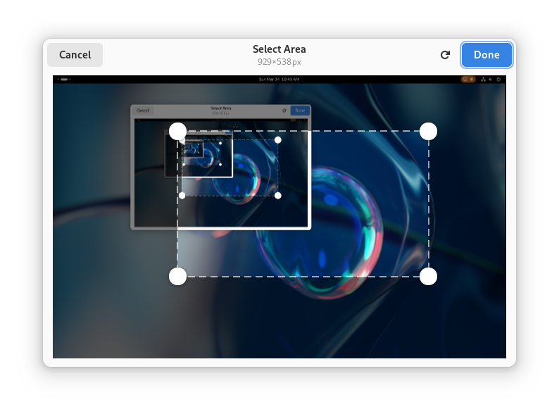
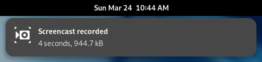

+++
title = "Kooha 2.3 Released!"
date = 2024-03-24T12:29:00.001+08:00
updated = 2024-03-24T12:29:00.001+08:00

[taxonomies]
tags = ["Software"]

[extra]
social_media_card = "card.png"
+++

> [Kooha](https://github.com/SeaDve/Kooha) is a simple screen recorder for Linux with a minimal interface. You can simply click the record button without having to configure a bunch of settings.

While we strive to keep Kooha simple, we also want to make it better. This release, composed of over [300 commits](https://github.com/SeaDve/Kooha/compare/v2.2.4...v2.3.0), is focused on quality-of-life improvements and bug fixes.
<!-- more -->

This release includes a refined interface, improved area selection, more informative notifications, and other changes. Read on to learn more about the new features and improvements.

## New Features and Improvements

### Refined Interface

The main screen now has a more polished look. It now shows the selected format and FPS. This makes it easier to see the current settings at a glance, without having to open the settings window.

Other than that, progress is now shown when flushing the recording. This gives a better indication when encoding or saving is taking longer than expected.

Furthermore, the preferences window is also improved. It is now more descriptive and selecting FPS is now easier with a dropdown menu.

### Improved Area Selection

The area selection window is now resizable. You can now resize the window to fit your screen better. Additionally, the previously selected area is now remembered across sessions. This means that if you close Kooha and open it again, the area you selected will be remembered. Other improvements include improved focus handling, sizing fixes, better performance, and a new style.

### More Informative Notifications

Record-done notifications now show the duration and size of the recorded video. This is inspired by GNOME Shell screencast notifications.

Moreover, the notification actions now work even when the application is closed.

### Other Changes

Besides the mentioned features, this release also includes:

* Logout and idle are now inhibited while recording.
* The audio no longer stutters and gets corrupted when recording for a long time.
* The audio is now recorded in stereo instead of mono when possible.
* The recordings are no longer deleted when flushing is canceled.
* Incorrect output video orientation on certain compositors is now fixed.
* Performance and stability are improved.

## Getting Kooha 2.3

Kooha is available on [Flathub](https://flathub.org/apps/io.github.seadve.Kooha). You can install it from there, and since all of our code is open-source and can be freely modified and distributed according to the license, you can also [download](https://github.com/SeaDve/Kooha/releases/tag/v2.3.0) and build it from source.

## Closing Words

Thanks to everyone who has supported Kooha, be it through donations, bug reports, translations, or just using it. Your support is what keeps this project going. Enjoy the new release!

