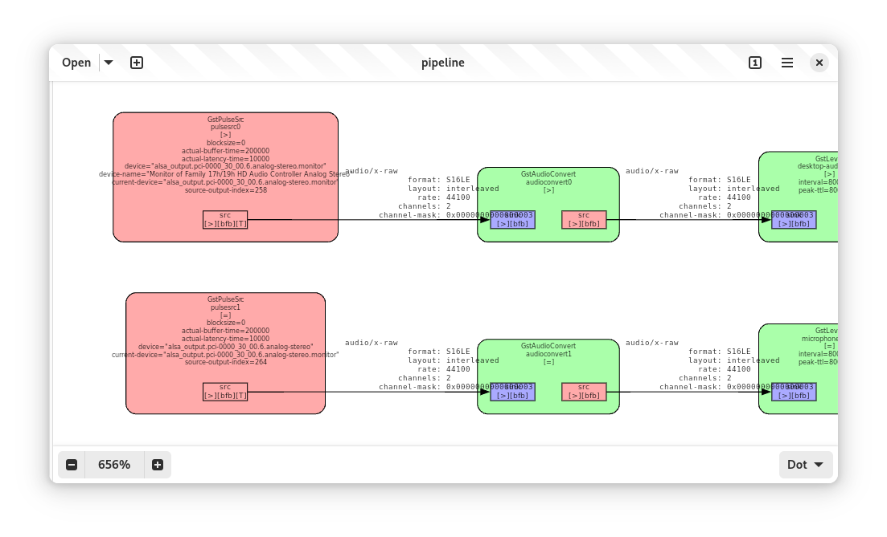
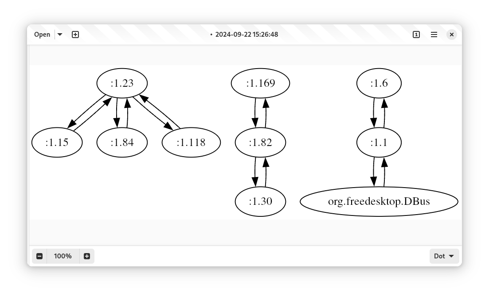
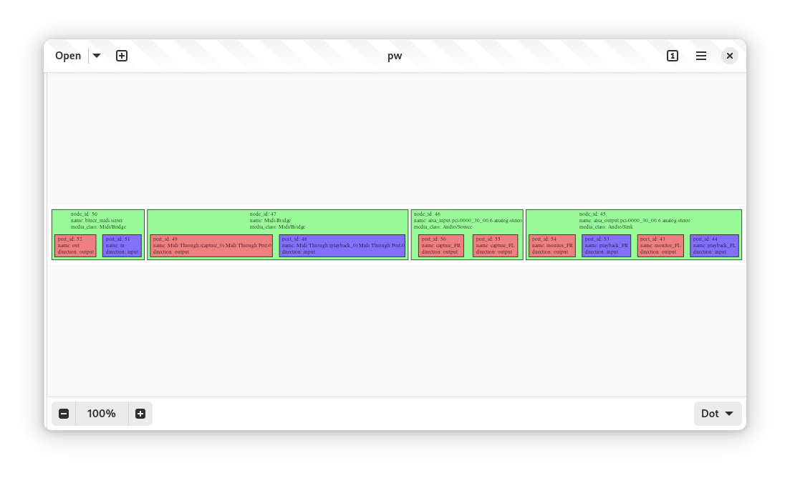
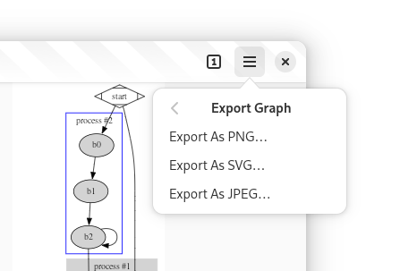
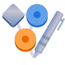

+++
title = "Introducing Delineate!"
date = 2024-09-23T12:29:00.001+08:00
updated = 2024-09-23T12:29:00.001+08:00

[taxonomies]
tags = ["Software"]

[extra]
social_media_card = "card.png"
+++

> Delineate provides facilities to edit and draw graphs specified in the [DOT language](https://graphviz.org/doc/info/lang.html). It is designed to be a simple and intuitive tool for creating and editing graphs, with a focus on the user experience.
<!-- more -->

As mentioned above, Delineate, previously named Dagger, is a new app to view and edit DOT graphs. It is like [KGraphViewer](https://apps.kde.org/kgraphviewer/), but with the ability to edit the graph and is built with LibAdwaita, which makes it more at home on GNOME. There is also another app called [GraphUI](https://github.com/artemanufrij/graphui), but it is currently unmaintained and designed for Elementary OS.

## Features

One of the main reasons I developed Delineate is for debugging GStreamer pipeline dumps. I use it extensively to visualize the pipeline, inspect the elements, and analyze the negotiations between them.

It is also useful for visualizing connections on the message bus, offering an alternative perspective to tools like Bustle.

Another use case I discovered from Bilal is visualizing the Pipewire graph from the `pw-dot` command.

The app also supports changing the layout engine on the fly, which is useful for tweaking the graph to make it more readable depending on the use case.

Also, thanks to the library behind the app, [d3-graphviz](https://github.com/magjac/d3-graphviz), it supports animations, which can be less jarring when modifying the graph.

Finally, you can export the graph to a PNG, SVG, or JPG image.

## Getting Delineate

Delineate is available on [Flathub](https://flathub.org/apps/io.github.seadve.Delineate). You can install it from there, and since all of our code is open-source and can be freely modified and distributed according to the license, you can also [download](https://github.com/SeaDve/Delineate/releases/tag/v0.1.0) and build it from source.

## Future Plans

Since this is the first release, there are many features I would like to add in the future. Some of the features I am considering are:

- More interactive editing and viewing features, such as selective highlighting of elements when searching.
- Support for other graph formats, such as [Mermaid](https://mermaid.js.org/).
- Bird's eye view for large graphs.
- More useful text editing features, such as auto-completion, color picker, and more.

## Closing Words

Before I end this post, I would like to thank Brage Fuglseth for the new name, Delineate, and the beautiful icon design.

I hope you find Delineate as useful as I do. If you have any feedback or suggestions, feel free to open a discussion or issue on the [GitHub repository](https://github.com/SeaDve/Delineate). Enjoy the release!
