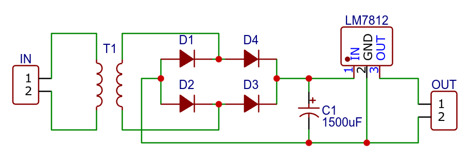

+++
title = "DIY 12V DC Power Supply"
date = 2025-01-23T12:29:00.001+08:00
updated = 2025-01-23T12:29:00.001+08:00

[taxonomies]
tags = ["Electronics", "3D Design"]

[extra]
social_media_card = "card.jpeg"
katex = true
+++

Let’s talk about our journey of creating something from scratch (almost?) for our **Electronics I** final project. It wasn’t groundbreaking like a full-blown multi-featured DC power supply, but it was a fulfilling learning experience.

*Spoiler alert: mistakes were made, lessons were learned, and yes, we had fun.*
<!-- more -->

## Design and Calculations

Everything began with brainstorming and sketching out ideas. This was our chance to put all the knowledge from our lectures to the test—from diode operating regions to voltage regulation. It was exciting but also a bit daunting.

The first decision was our power supply's specifications. We aimed for a **12V output**—a solid middle ground between complexity and functionality. Plus, the 5V option was already claimed by another group. For rectification, we chose a **full-wave bridge rectifier** due to its efficiency compared to the half-wave alternative.

Calculations? Oh yes, there were plenty! Transformers, diodes, capacitors, regulators—everything had to line up perfectly on paper before moving to reality.

We started at the output, aiming for a stable 12V. To achieve this, we selected the **LM7812 voltage regulator**. It was an obvious choice: simple, reliable, and readily available. With an input range of 14.5 to 27V, it could easily provide the 12V we needed.

Since the LM7812 can handle a maximum input voltage of 27V, a 12-0-12V transformer would be perfect. However, only a **6-0-6V transformer** was available, so we had to make do with that. Regarding with the diode, we used **1N4007** diodes as it is readily available and can handle our desired specifications.

Assuming the provided input voltage for the regulator is 15.5V, which is also the output of the rectifier $ V_{\text{p(rec)}} $, the output voltage of the secondary side of the transformer $ V_{\text{p(sec)}} $ must be:

$$ V_{\text{p(sec)}} = V_{\text{p(rec)}} + 1.4V = 15.5V + 1.4V = 16.9V_{\text{pk}} $$

*Note: The 1.4V was to account for the voltage drop across the diodes.*

or in RMS,

$$ \frac{16.9V_{\text{pk}}}{\sqrt{2}} = 11.95V_{\text{rms}} $$

This is perfect four our 6-0-6V transformer maximum output voltage of 12V in RMS.

Using the formula for ripple factor,

$$ r = \frac{V_{\text{r(pp)}}}{V_{\text{dc}}} $$

$$ V_{\text{r(pp)}} = r \times V_{\text{dc}} $$

we can determine the value of the filter capacitor, given a ripple factor $ r $ of 3% or 0.03, and output DC voltage $ V_{\text{dc}} $ of 12V.

$$ V_{\text{r(pp)}} = \frac{V_{\text{p(rect)}}}{f \times R_\text{L} \times C} $$

$$ C = \frac{V_{\text{p(rect)}}}{f \times R_\text{L} \times V_{\text{r(pp)}}} = \frac{V_{\text{p(rect)}}}{f \times R_\text{L} \times r \times V_{\text{dc}}} $$

We also know that a typical frequency of the AC input is 60Hz and we have to multiply it by 2 to get the frequency of the full-wave rectified output.

$$ f = 2 \times 60Hz = 120Hz $$

Also, given the maximum load current of 50mA, we can calculate the assumed load resistance.

$$ R_{\text{L}} = \frac{V_{\text{dc}}}{I_{\text{L}}} = \frac{12V}{50mA} = 240\Omega $$

Substituting the values,

$$ C = \frac{15.5V}{120Hz \times 240\Omega \times 0.03 \times 12V} = 1495 \mu F \approx 1.5 mF $$

Here is the final schematic diagram of our design based on the calculations:

## Construction

Moving on, we had to put our design into action. This was where the real fun began. We had to source the components, breadboard the circuit, design the PCB, and 3D-print the enclosure.

### Breadboarding

The breadboarding phase was a mix of excitement and confusion. We had to double-check every connection and component.

It was a tedious process, but the feeling when the 12V LED lit up? Priceless.

### PCB Design, Etching and Soldering

For the PCB design, we used EasyEDA. It was our first time using it, but it was surprisingly intuitive. We just had first to recreate the schematic diagram, then layout the components and traces.

Tracing the components on the PCB was a bit tricky, but we managed to get it done. It is like playing connect-the-dots, except no overlapping lines are allowed since we only had a single-layer PCB.

At the end, it was satisfying to see the final design.

We had to print it on a sticker paper, transfer it to the copper board, cut it, drill it, etch it, and solder the components. It was a long process, but the result was worth it.

Did we also mention that we soldered the regulator in reverse for the first time? Oops. But hey, we learned from it.

### Custom Enclosure

To make our project stand out, we decided to 3D-print a custom enclosure. Designing it on SketchUp was surprisingly fun.

It was also satisfying to see the once a software model come to life as a physical object.

## Testing

Testing day was a rollercoaster. Smoke-free? Check. Output voltage stable? Mostly.

### Line Regulation Via Varying Input Voltage

For the first table, we vary the input voltage, and we measured the input voltage, the transformer output, the filter output, the regulator output, and the percent voltage regulation.

| Trial No. | Input Voltage ($ V_{\text{rms}} $) | Transformer Output ($ V_{\text{rms}} $) | Filter Output ($ V_{\text{DC}} $) | Regulator Output ($ V_{\text{DC}} $) | \% Voltage Regulation |
| --------- | ---------------------------------- | --------------------------------------- | --------------------------------- | ------------------------------------ | --------------------- |
| 1         | 213                                | 12.1                                    | 13.58                             | 11.97                                | 5                     |
| 2         | 214                                | 11.2                                    | 13.82                             | 11.92                                | 5                     |
| 3         | 215                                | 10.7                                    | 13.73                             | 12.03                                | 10                    |
| 4         | 216                                | 11.5                                    | 13.80                             | 11.93                                | 10                    |
| 5         | 217                                | 10.8                                    | 13.26                             | 12.01                                | 9                     |
| 6         | 218                                | 11.0                                    | 13.59                             | 11.92                                | 9                     |
| 7         | 220                                | 11.3                                    | 13.74                             | 11.92                                | 2                     |
| 8         | 222                                | 12.5                                    | 13.61                             | 11.96                                | 2                     |
| 9         | 224                                | 12.3                                    | 13.57                             | 11.93                                | 10                    |
| 10        | 226                                | 11.9                                    | 13.88                             | 11.94                                | 10                    |
| Average   | -                                  | 11.53                                   | 13.67                             | 11.953                               | 5.5                   |

*Note: The load resistor is a 22Ω resistor.*

### Load Regulation Via Varying Load Resistance

For the second table, we vary the load resistance, and we measured the input voltage, the transformer output, the filter output, the regulator output, and the percent voltage regulation.

| Trial No. | Load Resistance ($ \Omega $) | Transformer Output ($ V_{\text{rms}} $) | Filter Output ($ V_{\text{DC}} $) | Regulator Output ($ V_{\text{FL(DC)}} $) | \% Voltage Regulation |
| --------- | ---------------------------- | --------------------------------------- | --------------------------------- | ---------------------------------------- | --------------------- |
| 1         | 220                          | 10.6                                    | 11.96                             | 10.22                                    | 16.4385               |
| 2         | 500                          | 10.7                                    | 12.83                             | 11.43                                    | 4.1120                |
| 3         | 1k                           | 11.1                                    | 13.05                             | 11.46                                    | 3.8394                |
| 4         | 2k                           | 11.1                                    | 13.06                             | 11.48                                    | 3.6585                |
| 5         | 5k                           | 10.6                                    | 13.20                             | 11.49                                    | 3.5683                |
| 6         | 6k                           | 10.9                                    | 13.26                             | 11.78                                    | 1.0187                |
| 7         | 10k                          | 11.2                                    | 13.39                             | 11.85                                    | 0.4219                |
| 8         | 11k                          | 11.3                                    | 13.91                             | 11.87                                    | 0.2527                |
| 9         | 20k                          | 11.3                                    | 13.53                             | 11.89                                    | 0.0841                |
| 10        | 22k                          | 11.1                                    | 13.27                             | 11.90                                    | 0                     |
| Average   | -                            | 10.99                                   | 13.15                             | 11.54                                    | 3.3394                |

*Note: The primary voltage applied to the transformer was 220V in RMS. The $ V_{\text{NL(DC)}} $ used in computing the % voltage regulation is 11.9 V.*

### Data Interpretation

Looking at the tables, the LM7812 did a great job keeping the output mostly steady at 12V, even when we threw in some wild input voltage swings—what a champ! That said, when the load resistance became too low, it struggled a bit, showing the limits of our trusty (but modest) 6-0-6V transformer. On the other hand, our filtering capacitors stepped in like unsung heroes, keeping the ripples under control and giving us a smooth DC output.

## Closing Words

This DC power supply project was a fantastic learning experience—it brought classroom concepts to life and gave us hands-on insight into circuit design and testing. While it performed well for what it is, it’s important to note that this design isn’t meant for serious, high-stakes applications. Think of it more as a stepping stone than a professional-grade benchmark.

Overall, we learned a lot about troubleshooting, design limitations, and real-world performance. With a bit more fine-tuning, this could even inspire more advanced builds down the line. For now, it’s a win for learning and the satisfaction of making something work (mostly) as planned!

Special thanks to our professor for guiding us and to my amazing groupmates—Roneline, Rhaniel, Peejay, Aaron, and Rohn—for making this experience enjoyable and productive (ask them?). Cheers to teamwork and lessons learned!

If you have any questions or feedback, feel free to leave a comment below. We’d love to hear your thoughts or critiques. Until next time, happy tinkering!
