+++
title = "Browser Benchmark Comparison 2021: Chrome vs. Edge vs. Firefox vs. Brave vs. Chromium vs. Epiphany"
date = 2021-01-16T15:46:00.004+08:00
updated = 2023-05-11T23:45:51.417+08:00

[taxonomies]
tags = ["Benchmark"]

[extra]
social_media_card = "card.png"
+++

We all know that Google is already dominating the search engine share. Meanwhile, in terms of the browser market share, it is no different. Many browsers nowadays such as Brave and even Microsoft Edge are based on Google's open-source project, Chromium.
<!-- more -->

In this article, I will compare various popular web browsers. Four of them use Blink/V8 as their engine while Firefox and GNOME Web (Epiphany) use Gecko and WebKitGTK respectively.

I ran eight benchmarks to test the performance of these browsers. I also measured the RAM usage of each browser manually using GNOME System Monitor. Note that if you replicate this test, your results may differ because you are probably using a different computer.

Spoiler alert... **Chrome wins!**

## Setup

I used a Laptop that is connected to a wall socket to do this comparison.

* Intel i3-2310M
* 3 GB DDR3
* Fedora 33 Workstation Edition
* Linux 5.10.6
* GNOME Shell 40.0 on Wayland

### Browser used

All are set in their default configurations. No additional extensions are installed. I tested two variants of Firefox, one with WebRender enabled.

* Firefox 84.0.2
* Firefox  84.0.2 (gfx.webrender.all set to true)
* Chrome 87.0.4280.141
* GNOME Web 3.38.2
* Chromium 87.0.4280.88
* Brave 1.18.78
* Edge Dev 89.0.760.0

## Results

### MotionMark 1.0

[MotionMark](https://browserbench.org/MotionMark/) is used to measure a browser's capability to animate complex scenes at a target frame rate.

#### Brave wins!

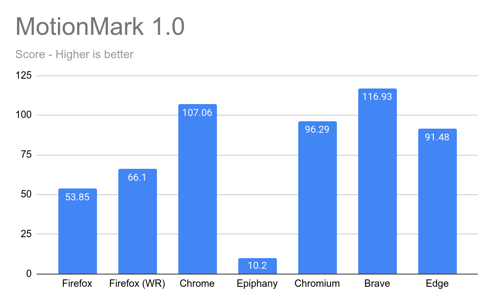

### Kraken 1.1

[Kraken](https://mozilla.github.io/krakenbenchmark.mozilla.org/) is a JavaScript performance benchmark that measures the speed of browsers through different tests extracted from real-world applications and libraries.

#### Chrome wins!

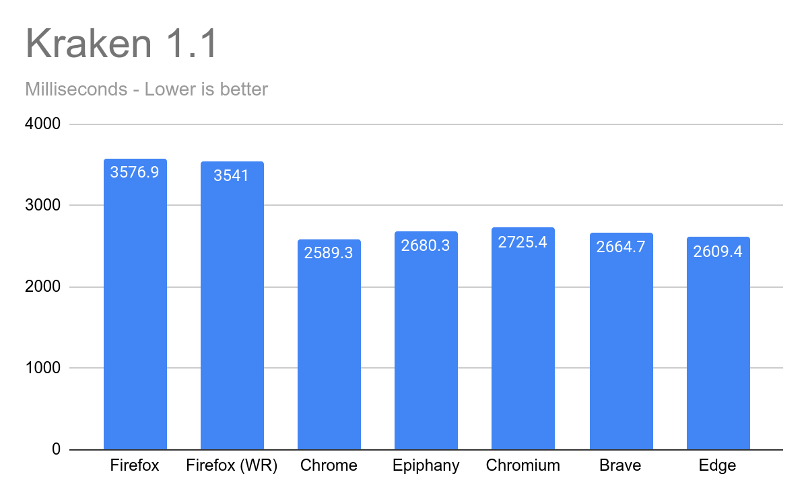

### Octane 2.0

[Octane](https://chromium.github.io/octane/) is a benchmark that measures a JavaScript engine's performance through a suite of tests representing certain use cases in JavaScript applications.

#### Epiphany wins!

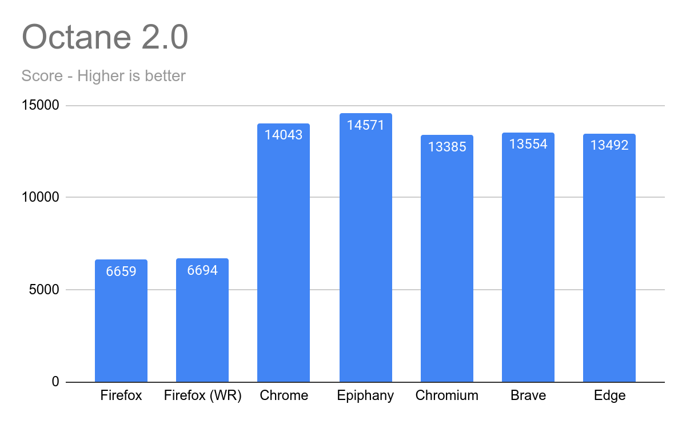

### WebXPRT 3

[WebXPRT](https://www.principledtechnologies.com/benchmarkxprt/webxprt/2018/3_v5/) measures the performance of a browser through six HTML5 and JavaScript scenarios that mirror real-life tasks.

#### Epiphany wins!

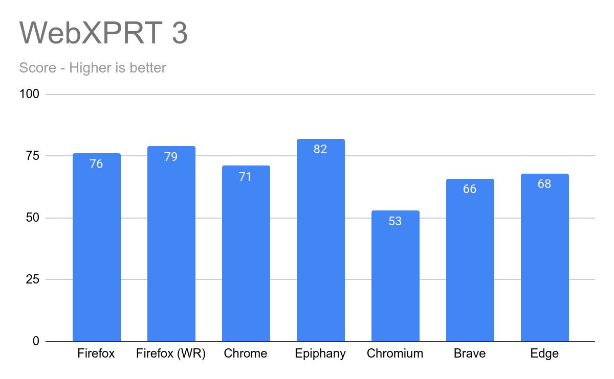

### Maze Solver (30x30)

[Maze Solver](https://testdrive-archive.azurewebsites.net/performance/mazesolver/default.html) exercises the browser's handling of CSS 2.1 and CSS 3 layer constructs which are important components of overall web browser performance.

#### Epiphany wins!

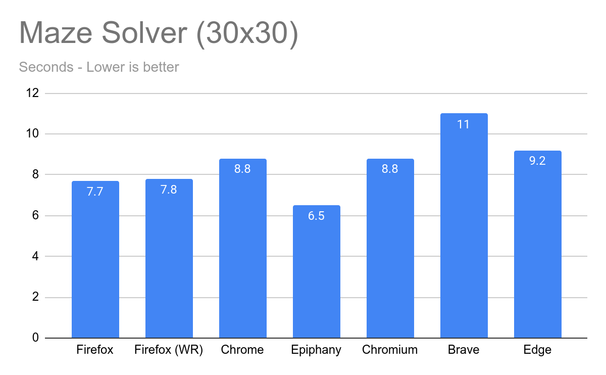

### Speedometer 2.0

[Speedometer](https://browserbench.org/Speedometer2.0/) is a browser benchmark that measures the responsiveness of web applications.

#### Chrome wins!

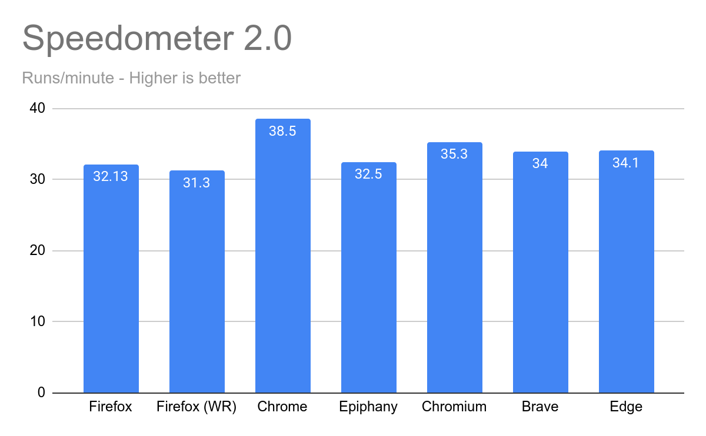

### RAM Usage with 5 tabs open

I opened a total of five tabs: YouTube, Reddit, DuckDuckGo, GitHub and New York Times.

#### Firefox wins!

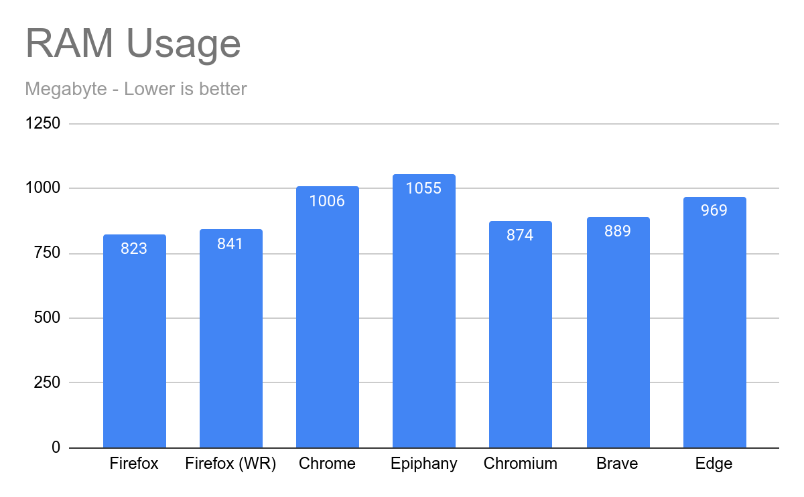

### Overall Results

#### Chrome wins!

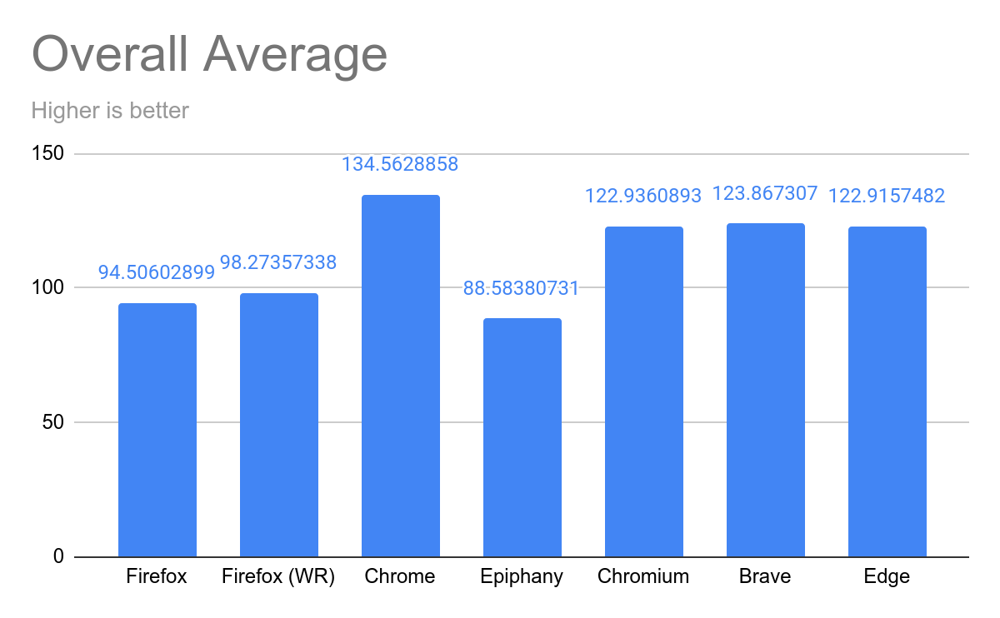

 

Take note that I didn't include Basemark and JetStream results on the overall average as Firefox and Epiphany were not able to run these benchmarks without crashing, at least on my hardware.

### Basemark Web 3.0

[Basemark Web](https://web.basemark.com) tests how well a browser performs on web-based applications.

#### Epiphany wins!

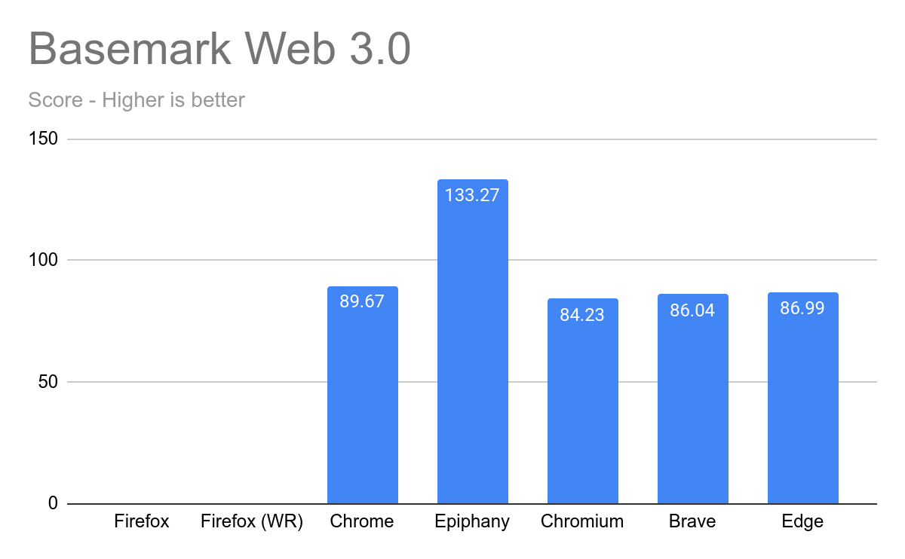

### JetStream 2

[Jetstream](https://browserbench.org/JetStream/) rewards browsers that start up quickly, execute code quickly and run smoothly.

#### Chrome wins!

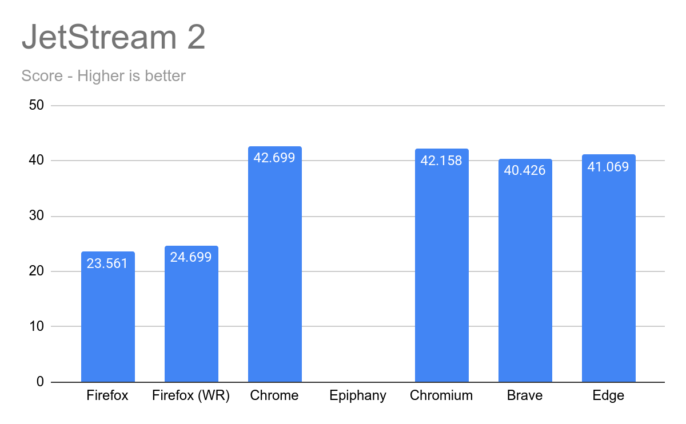

## Conclusion

In the end, all browsers are capable of handling daily tasks. As long as it provides you with regular security updates and also privacy, you do not need to switch to another web browser for a minuscule performance difference. And remember, performance should not be your only consideration on choosing a web browser. Have a nice day!

## Appendix

These are the raw benchmark results:

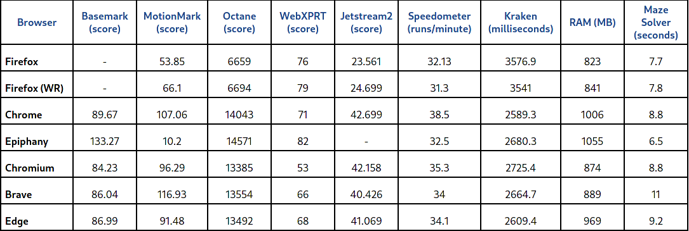

