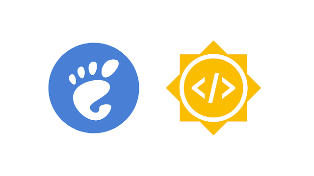
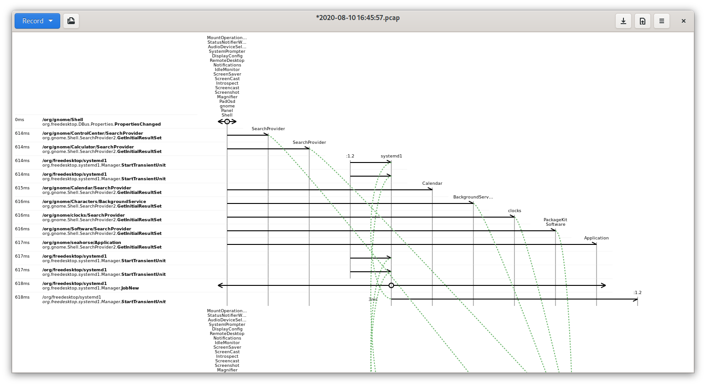

+++
title = "GSoC 2023: Rust and GTK 4 Bustle Rewrite (Introduction)"
date = 2023-05-11
updated = 2023-07-07

[taxonomies]
tags = ["GSoC"]
+++

Hello there!

I am Dave Patrick Caberto, a first-year Electronics Engineering student from Bataan Peninsula State University, Philippines. This summer, I will be working on the Rust and GTK 4 rewrite of Bustle, a D-Bus activity visualizer, with the guidance of my mentors, Bilal Elmoussaoui and Maximiliano Sandoval.

## Me and my bizarre open-source journey

Weirdly enough, I first discovered Linux five years ago on a failed attempt to do Hackintosh. I got bored with Windows that I decided to try something new and different, and that's when I eventually stumbled upon Linux, specifically Elementary OS. It did not last for me since I still depend a lot on applications that are only available with Windows.

Fast-forward two years later, I decided to give Linux another try with KDE Neon and migrate my workflows to open-source applications such as LibreOffice, Inkscape, and Kdenlive. I remember feeling adventurous and breaking my system numerous times, though I considered it as part of the learning process. I was intrigued by the idea of being a part of a community of passionate developers and enthusiastic users. I also liked the customization it had. However, as I grew with it, I started to realize that I had spent way too much time configuring things and forgetting to focus on what was really important, and that is when I discovered GNOME.

When I first used GNOME, it was a totally different workflow, and I liked it. It was simple; the UI made sense. At that time, there was some software I was missing, particularly a screen recording application that works nicely on Wayland. That was the time I discovered RecApp. It worked well; however, it looked not at home, even for a GTK application. One of my first contributions was creating a mockup for the redesign, and I also took that opportunity to learn Python and GTK and implement my mockup. I was not necessarily proud of my code, but I was proud and happy about having the chance to contribute to the software I use and the community.

A few months later, as I learned more about programming and the GNOME developer ecosystem, there were many more things I'd like to improve and change in RecApp, some of which other contributors did not agree with. That's when Kooha was born, with a total in-and-out redesign of RecApp and a different focus and ideology. Almost a month later was also the birth of Mousai, a song recognizer application. Since then, I have been maintaining these two applications.

There are definitely a lot of things I missed, but that was a quick summary of my journey with open-source.

## More about Bustle and the project

For those who have not heard of Bustle, it is an application used to visualize D-Bus activities. It shows signal emissions, method calls, method returns, and errors, which is useful in observing traffic, debugging, and optimizing performance in D-Bus applications.

Although the current implementation of Bustle in Haskell and GTK 3 is functional, there are noteworthy reasons to consider a rewrite in Rust. Some of these advantages include having access to a range of libraries, such as zbus, gtk4-rs, and LibPCAP bindings. Aside from this, the growing Rust community and the availability of the Rust SDK in Flathub would make the tool more accessible to contributors and simpler to distribute to the users. On the other hand, porting Bustle to GTK 4 would over benefits such as the newer and more modern LibAdwaita widgets and ListView API, which would make it easier for the tool to comply with the HIG and benefit from the latest developments in the platform.

Altogether, this rewrite and port will contribute to the maintainability, accessibility, and future-proofing of Bustle through the use of newer technologies and arguably more ergonomic technologies.

 

I will be posting updates about the project every few weeks for the next few months, including more details about the plans for this GSoC project. If you'd like to talk about something, feel free to contact me at Matrix `@sedve:matrix.org`.

Thanks for reading!
