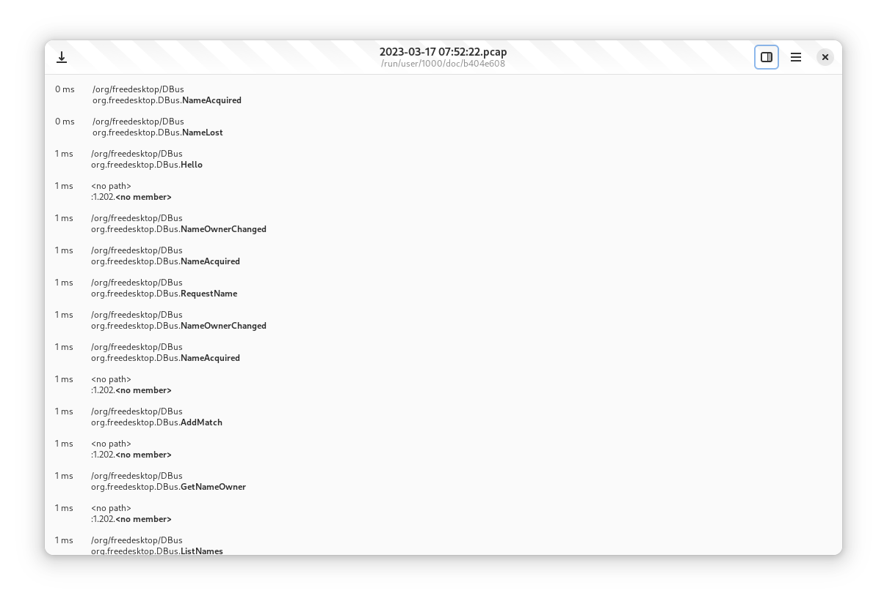
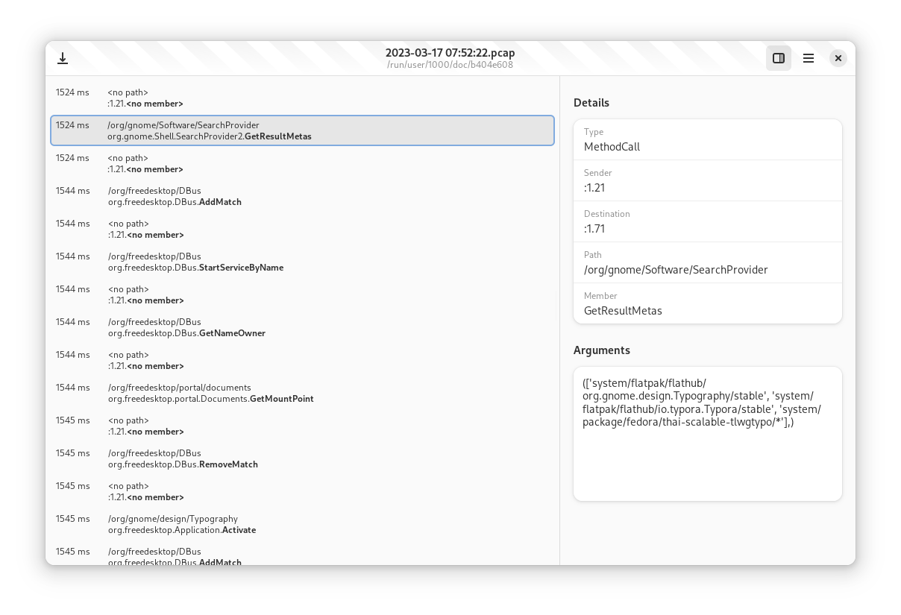

+++
title = "GSoC 2023: Rust and GTK 4 Bustle Rewrite (Week 1 & 2)"
date = 2023-06-11T19:09:00.005+08:00
updated = 2023-06-11T19:25:18.353+08:00

[taxonomies]
tags = ["GSoC 2023"]

[extra]
social_media_card = "card.png"
+++

## Progress Made

Before the GSoC coding period started, I started implementing the diagram used to display DBus activity with the help of the template repository made by my mentor, Maximiliano. One of the first challenges is figuring out how to load the PCAP files, which is the format Bustle uses to store the DBus messages. Without implementing that first, it would be difficult to test how the diagram will look like.<!-- more -->

The Rust PCAP library was used to load the packets from the PCAP file, which contains the bytes of a DBus Message. It is nice to use, though it is missing an async API for loading files. That could be fixed in the future, but this week mainly focused on a basic diagram implementation. The bytes can then be parsed through GDBus into a `GDBusMessage`, which contains the information to implement the diagram.

Through the parsed message, the diagram can be implemented. It uses `GtkListView` to display the rows as, aside from having a nice separation of view and model, it is more efficient because it recycles widgets, especially since PCAP files could possibly contain thousands of messages. Each row contains the elapsed time, path, destination, interface, and member of the message.

Aside from the diagram, a `DetailsView` was also implemented. It shows the sender and the body, and also the destination, path, and member of the message. For more information about it, you can check out the [merge request](https://gitlab.gnome.org/msandova/bustle/-/merge_requests/1).

GDBus was used initially as zbus is missing the necessary APIs for parsing messages from bytes. However, the merge requests are already on the way to implement those upstream, including a nicer way to print `zbus::Value` that would match how `GVariant`s are printed.

* [zv: impl Display for Value, Array, Structure, Dict & Maybe](https://github.com/dbus2/zbus/pull/379)
* [zb: Add a from_bytes constructor for Message](https://github.com/dbus2/zbus/pull/370)

## Plans for the Following Weeks

While the merge requests are in place, there is still some work to do, such as fixing up the Display implementation for `zbus::Value::Str` and `zbus::Value::Array`. Once the mentioned merge requests are merged, we could finish up the [zbus port](https://gitlab.gnome.org/msandova/bustle/-/merge_requests/2).

After the application is fully ported to zbus, we could start working on the more complicated part of the Diagram implementation, like showing signals and the method call and return arrows.

 

That's all for this week. See you again in the next weeks. Thanks for reading!
