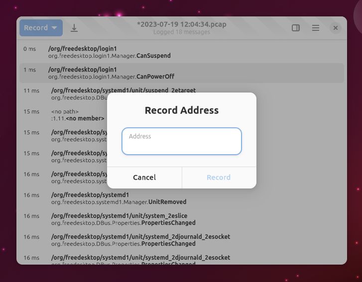

+++
title = "GSoC 2023: Rust and GTK 4 Bustle Rewrite (Week 5 & 6)"
date = 2023-07-19T11:51:00.002+08:00
updated = 2023-07-19T11:51:00.002+08:00

[taxonomies]
tags = ["GSoC 2023"]

[extra]
thumbnail = "thumbnail.png"
+++

## Progress Made

This week, the [PR to implement Display for Value, Array, Structure, Dict & Maybe](https://github.com/dbus2/zbus/pull/379) has been merged. Thus, there is a much nicer way now upstream to display `zbus::Value`, similar to `GVariant`. With this blocker cleared out, the [zbus port MR](https://gitlab.gnome.org/msandova/bustle/-/merge_requests/2) has also been merged, fully porting the Bustle rewrite to zbus.

Furthermore, my mentor, Bilal, started implementing session monitoring and saving to a PCAP file while I continued their work and [implemented system and address recording](https://gitlab.gnome.org/msandova/bustle/-/merge_requests/12). However, it is not yet merged as there are some things to be figured out and more work to do. Specifically, it currently requires a `dbus-monitor` binary installed on the host, which is not great for distributions that do not package it.

Aside from those mentioned above, I have also been working on drawing the diagram. I am still studying the older Haskell codebase to prevent reinventing the wheel on some implementations. Unfortunately, the current implementation is still not ready enough for a screenshot.

To easily track the missing features, we also set up an [issue board](https://gitlab.gnome.org/msandova/bustle/-/boards).

## Plans for the Following Weeks

In the following weeks, I will get the PR to implement and address recording merged and work on more parts of the diagram drawing.

 

That's all for this week. Thanks for reading!
