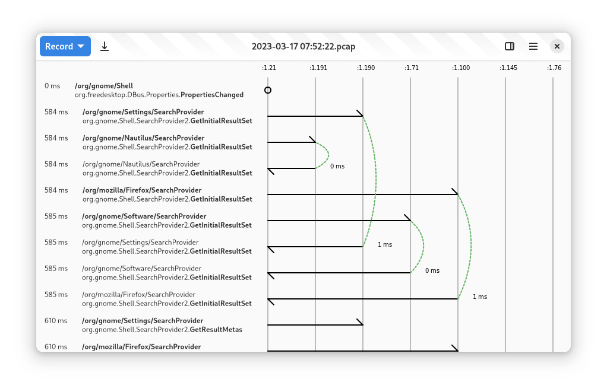

+++
title = "GSoC 2023: Rust and GTK 4 Bustle Rewrite (Week 7 & 8)"
date = 2023-08-02T18:29:00.001+08:00
updated = 2023-08-04T21:34:00.002+08:00

[taxonomies]
tags = ["GSoC 2023"]

[extra]
thumbnail = "thumbnail.png"
+++

## Progress Made

A lot of things happened these past few weeks. First, the [MR to add address and system DBus recording](https://gitlab.gnome.org/msandova/bustle/-/merge_requests/12) has already been merged. Though, before that was merged, a few revisions have been made: it now parses from messages bytes directly, instead of a PCAP stream, to prevent overhead. Additionally, it now properly propagates errors, such as when the `dbus-monitor` binary is not found.<!-- more -->

Second, when recording, the sequence diagram now [sticks at the bottom](https://gitlab.gnome.org/msandova/bustle/-/merge_requests/14) because, in common use cases, it is mostly wanted to observe the new messages as they come.

Moreover, on the smaller changes, [PCAP file loading is now synchronous](https://gitlab.gnome.org/msandova/bustle/-/merge_requests/13), the [gtk4-rs dependency has now been updated to the recently released 0.17 version](https://gitlab.gnome.org/msandova/bustle/-/merge_requests/15), the [accuracy of timestamp calculations has been improved](https://gitlab.gnome.org/msandova/bustle/-/merge_requests/18), and the [focus issue on the address dialog has been fixed](https://gitlab.gnome.org/msandova/bustle/-/merge_requests/19).

Lastly, the signals and method call arrows and arcs are now (finally!) drawn in the diagram. While it looks simple, it took me days to get it right. However, there is no merge request yet since it requires more bug fixing and code cleanup.

## GUADEC

Aside from working on the code, I also attended GUADEC remotely. I had a lightning talk about a bit about myself and an overview of this project.

## Plans for the Following Weeks

For the next weeks, the diagram still needs bug fixing and polishing, as mentioned. For instance, it currently does not draw arcs on method calls when either the call or return row is not visible. The header is also only visible when scrolled all the way to the top, and it only shows the unique name instead of the well-known name.

After the diagram is completed, we will go on with the implementation of service filtering and adding a more convenient way to have multiple instances of recording or opened files via tabs.

 

That's all for this week. Thanks for reading!
