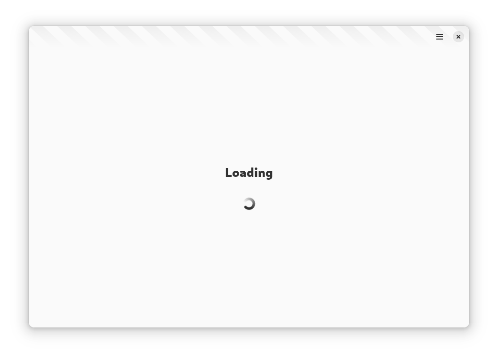
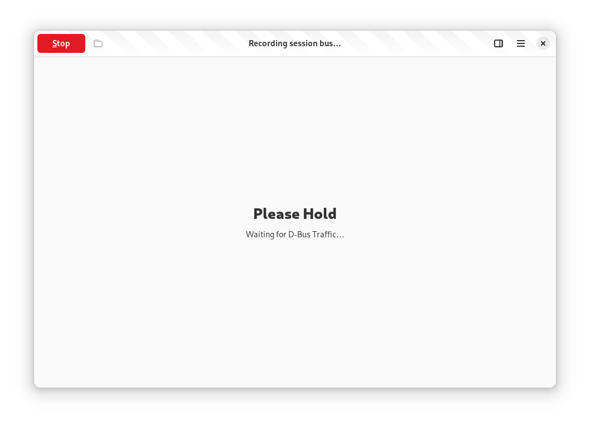
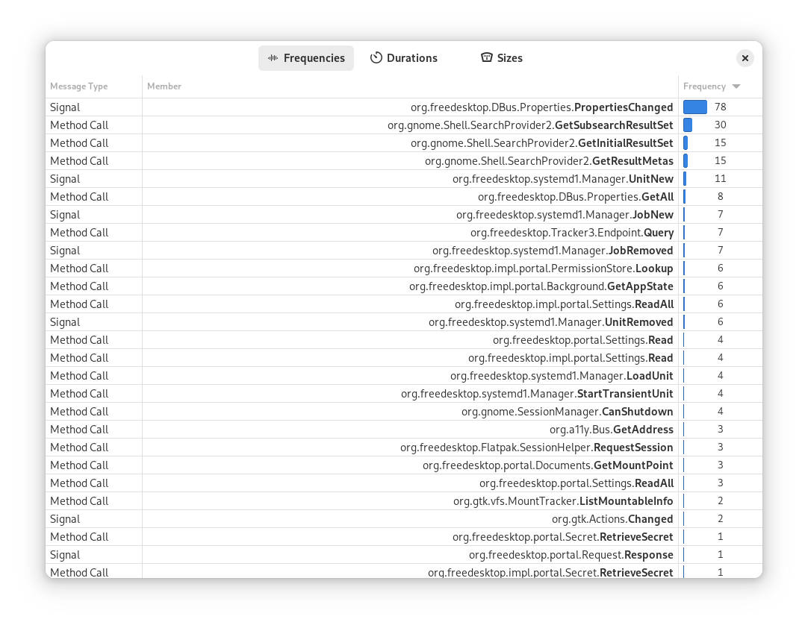
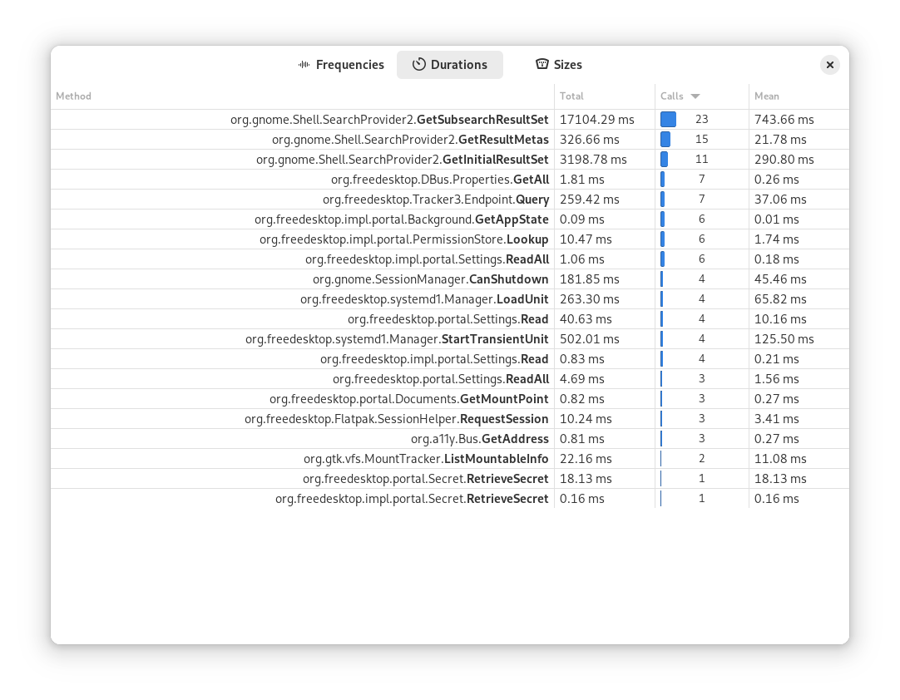
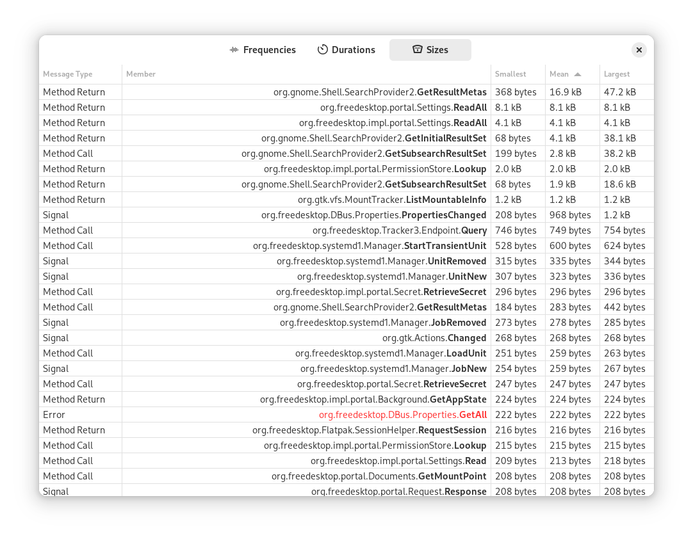
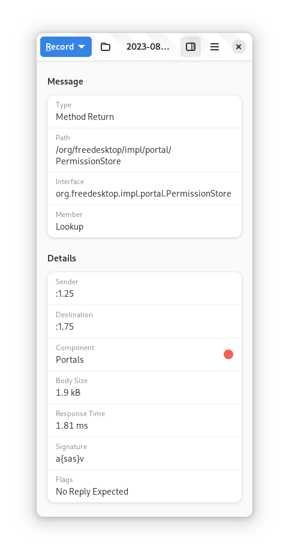
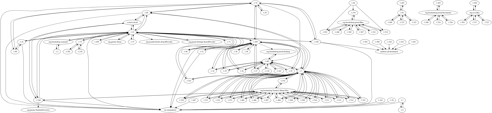
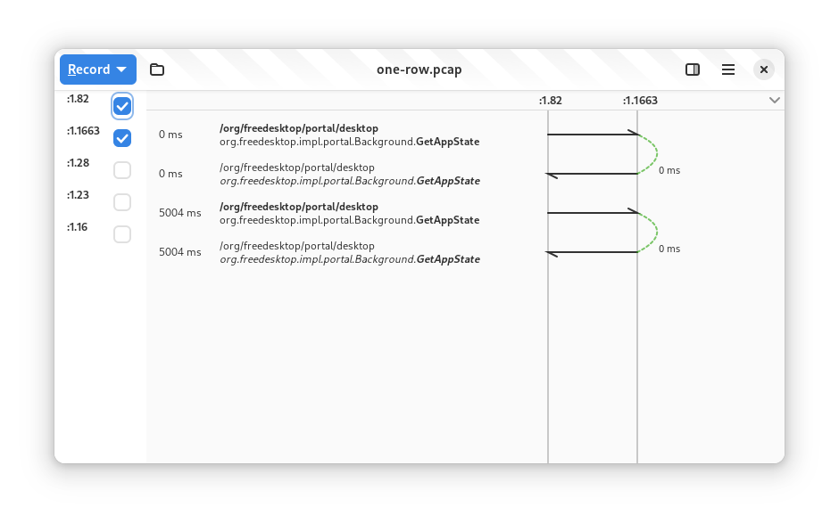

+++
title = "GSoC 2023: Rust and GTK 4 Bustle Rewrite (Week 9 & 10)"
date = 2023-08-19T20:29:00.001+08:00
updated = 2023-08-19T21:34:00.002+08:00

[taxonomies]
tags = ["GSoC 2023"]

[extra]
thumbnail = "thumbnail.png"
+++

## Progress Made

I am thrilled to announce that a lot of progress happened once again over the past few weeks! Starting with the most important thing, the diagram, a lot of bugs has been squashed and the rendering performance is now improved to a [usable and merge-able state](https://gitlab.gnome.org/msandova/bustle/-/merge_requests/34).<!-- more -->

Aside from that, it now has a header that doesn't overlay on the diagram, the drawings now properly adjust to text scale factor changes, the signal arrows are now drawn, and the rows are no longer clipped into the row titles.

My mentor, Bilal, also worked on [adding tags](https://gitlab.gnome.org/msandova/bustle/-/merge_requests/45), the colored circles in the diagram, so it is easier to determine the category of a message.

On the general UI side, there is now a [proper loading page](https://gitlab.gnome.org/msandova/bustle/-/merge_requests/30) that is shown while waiting for the PCAP files to show.

However, that may not be as useful as we also landed a [patch](https://gitlab.gnome.org/msandova/bustle/-/commit/d3d29c4c7becb42c33e789287ce467cf0e02ae32) that speeds up loading by up to 32 times; that's from 16 seconds on average to 500 milliseconds, when loading a 2.2 MB file.

There is also now a waiting page that shows before the first message arrives while recording.

We also landed [statistics window](https://gitlab.gnome.org/msandova/bustle/-/merge_requests/20) which shows frequencies of messages, durations of method calls, and sizes information of each message.

My mentor, Bilal, also worked on adding information on the details view including the body size and signature, and the response time from method return to its call.

There is also now a way to [save the PCAP file as a DOT graph file](https://gitlab.gnome.org/msandova/bustle/-/merge_requests/28), which can be used to generate a graph using Graphviz to visualize interactions between bus names like the following:

On the plumbing side, [saving to PCAP file is now asynchronous](https://gitlab.gnome.org/msandova/bustle/-/commit/ba0c05b2a10a5d48f245a61176242a1f2d8175ce), avoiding blocking the UI. We also ported from using `libpcap` to a pure Rust library, [removing unsafe code and simplifying the codebase](https://gitlab.gnome.org/msandova/bustle/-/commit/a43a8f481d7dc8bd7d430eba50bfdf04a11efccb). Furthermore, the timestamp computation is now [more accurate](https://gitlab.gnome.org/msandova/bustle/-/commit/d603ecbc151dfa341a9d500ed7cd37b7292a13c3).

As part of making debugging in Bustle easier, I have also submitted a [patch](https://github.com/dbus2/zbus/pull/450) to `zbus` to simplify the printing of bus names.

Finally, I started prototyping services filtering. It is still a proof of concept and does not look great, but it already functions and is a good starting point for next week.

## Plans for the Following Weeks

The following weeks will be the last days of GSoC and I will be focusing on finishing up the remaining tasks. With the most difficult part of this GSoC project done, most of the tasks left, aside from services filtering, are optimizing performance and cleaning up the codebase.

There are also a few more things to fix such as a proper name owner changed signal handling, drawing method call arc regardless if the row is not drawable, properly killing the `dbus-monitor` process, and propagating user-facing errors.

I would also like to add features such as adding a button that scroll to the method call message of a method return message or vice-versa, porting to use the [new `GskPath` APIs](https://docs.gtk.org/gsk4/struct.Path.html), and adding a way to open multiple diagrams at once via tabs and multiple windows.

 

That's all for this week. Thanks for reading!
